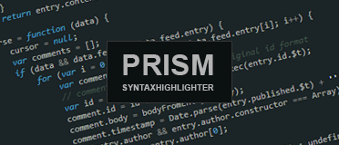
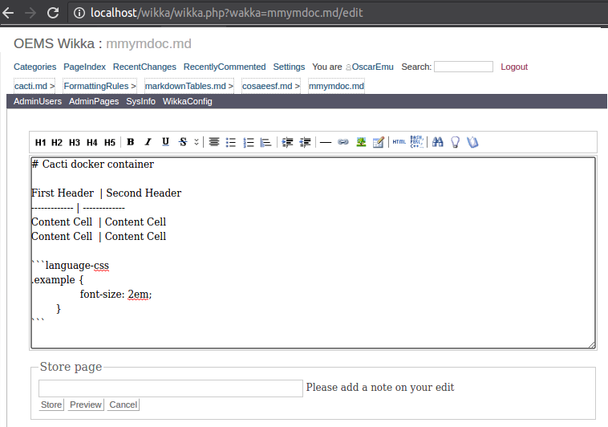
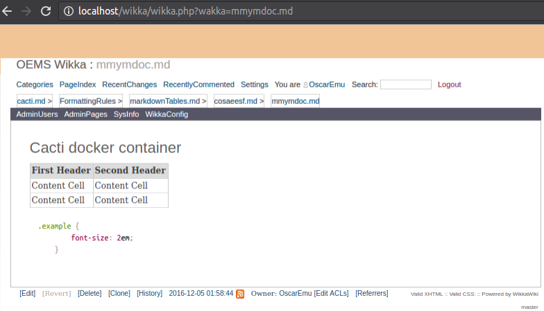
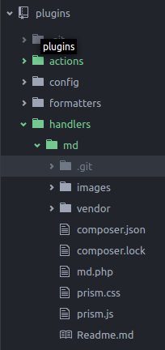

# WikkaWiki Markdown Handler plugin
[](http://markdown.cebe.cc)
[](http://wikkawiki.org/HomePage)
[](http://prismjs.com/)

## What is this?
Yes, this is a markdown parser for [WikkaWiki](http://wikkawiki.org/HomePage) for Markdown, the magic is from the [Cebe Markdown parser](http://markdown.cebe.cc/).


> Note that the current Geshi buttons are for the Wikka format, Im am working on use the [yii2-markdown](https://github.com/kartik-v/yii2-markdown), for the edit controls. But Markdown is not a dificult Format to learn.

Easy steeps:

1. Put this repo on "/plugins/handlers/md" directory.

2. Copy the prisma css and js to your theme.

3. Add the ".md" support to your Wakka.class.php file, this like on the example located on this repo "examples/Wakka.class.php.example".

The detalled installed is explain on the next points:
(Sorry for my English Im gonna to fix this at some time.)



## Why?
By defect WikkaWiki has their own formatting rules (these rules work like a charm), but on this days is very common to write all kain of documentation on Markdown, Markdown is the prefered formatting code for all kain of projects. I dont have a problem to know both ways of formatting, but is a lot of work traduce from one to the other, this plugin works on this point.

## How?
This plugin works in two ways (both if you wish), supose that mydoc and mydoc.md contains a document on Markdown format:

1. With a Handler md.
For example:
```
 wikka.php?wakka=mmymdoc/md
```

2. With a document that finish on ".md".
For example:
```
 wikka.php?wakka=mmymdoc.md
```

### How install it?
This plugins has two behaviors:

#### Install the handler:
The first is like a simple Handler, this meaning that you have to add "/md" to the end of the url. In any case you have to install the handler for both opions:

1. Drop this repo on your "/plugins/handlers/md" directory.
Directory Estructure:


2. Copy the prism.js and prims.css to your "templates" directory (look into your configuration file your theme classic/kubric/light and copy on your respective css/js directorys).

```php
....
'theme' => 'classic'
....

```

Now, If you completed this, create a new document like this:

~~~~
wikka.php?wakka=mmymdoc
~~~~

~~~~
# Cacti docker container

First Header  | Second Header
------------- | -------------
Content Cell  | Content Cell
Content Cell  | Content Cell

```language-css
.example {
		font-size: 2em;
	}
```
~~~~

And try to acces with:
~~~~
wikka.php?wakka=mmymdoc/md
~~~~

#### Configure for automatic access:
If you are like me, you want to access to the document direct without adding "/md", then you have to add the support for the ".md" extencion on your wikis documents.

Edit the follow code near to the end of "libs/Wakka.class.php", backup your original file and the new must be like:

```php
elseif( $this->GetHandler() == 'show' && pathinfo($this->GetPageTag(), PATHINFO_EXTENSION) == 'md' && $this->page['body'] != '' )
{
  // Hugly handler but util.
  $this->Handler($this->handler = 'md');
  echo $this->Header();
  echo $this->Handler($this->GetHandler());
  echo $this->Footer();
}
```
On any case I leave a copy of my Wakka.class.php on the project directory.

From now you can create mmymdoc.md and the system gonna to use the Markdown parser automaticly. (you can access to the edit page with dobleclik like the normal way.)

```
 wikka.php?wakka=mmymdoc.md
```


If you dont have highliht review the css and js prism path:


> Note that the current Geshi buttons are for the Wikka format, Im am working on use the [yii2-markdown](https://github.com/kartik-v/yii2-markdown), for the edit controls. But Markdown is not a dificult Format to learn.

[WikkaWiki](http://wikkawiki.org/HomePage) is a flexible, standards-compliant and lightweight wiki engine written in PHP, which uses MySQL to store pages.
[Cebe Markdown parser](http://markdown.cebe.cc/) A super fast, highly extensible markdown parser for PHP.
